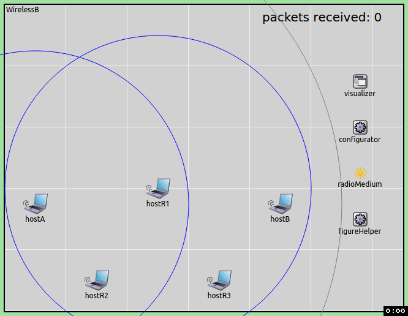

<header>

  

    

    <h1 style="color: #014872; font-size: 48px">INET Framework</h1>
    

      An open-source OMNeT++ model suite for wired, wireless and mobile networks. 
      INET evolves via feedback and contributions from the user community. 
      <a class="btn btn-primary" style="margin-top: 1em" href="Introduction.html">Learn more</a>
      <a class="btn btn-primary" style="margin-top: 1em" href="inet-showcases/">Example simulations</a>
    

  

</header>

  

      

        <h3>Learn INET</h3>
        <h4>Getting Started</h4>
        
Learn how to get INET up and running, and how to implement your simulations.

        <ul style="padding-left: 15px">
          <li><a href="GettingStarted.html">Getting Started with INET</a></li>
          <li><a href="inet-showcases">Browse the Showcases</a></li>
          <li><a href="inet-tutorials">Study the Tutorials 
            </a>
          </li>
        </ul>

        <h4>Documentation</h4>
        <ul style="padding-left: 15px">
          <li><a href="Protocols.html">Model Catalog</a></li>
          <li><a href="http://inet.omnetpp.org/doc/INET">INET Reference</a></li>
        </ul>
      

      

        <h3>News</h3>
        
            <a href="{{ post.url }}">{{ post.title }}</a> <small>({{ post.date | date: "%b %-d, %Y" }})</small> 
        
        <a href="/News.html">More...</a>
     

      

        <h3>Development</h3>
        
INET is developed by the OMNeT++ core team for the community, and
        with contributions from the community, on <a href="Repository.html">GitHub</a>.

        
Check out <a href="Plans.html">our plans</a> for the next versions of INET.

        <h4>Contribute</h4>
        
INET is open source, and its future largely depends on where the user community wants
        to take it.

        
Ways you can help:

        <ul style="padding-left: 15px">
          <li>Report bugs, submit pull requests</li>
          <li>Contribute <a href="inet-showcases/">example simulations</a> or <a href="ContributionIdeas.html">models</a></li>
          <li>Be a <a href="ComponentAdvisors.html">Component Advisor</a> or 
             <a href="CommunityCoordinators.html">Community Coordinator</a>
          </li>
        </ul>

      

  

