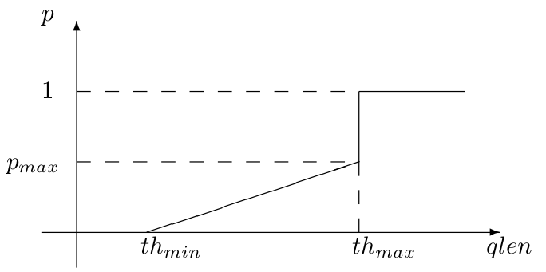
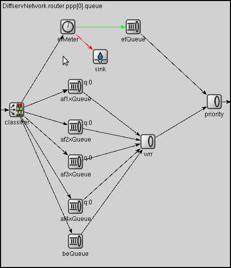

INET 4.0 User's Guide

<a href="chap11.html">Prev</a> &#8226; <a href="chap13.html">Next</a> &#8226; <a href="toc.html#toc_12">ToC</a> &#8226; <a href="index.html">Chapters</a>
<h1>12 Differentiated Services<a class="headerlink" href="#cha:diffserv" title="Permalink to this headline">&para;</a></h1>

<h2>12.1 Overview<a class="headerlink" href="#sec:diffserv:overview" title="Permalink to this headline">&para;</a></h2>

In the early days of the Internet, only best effort service was defined.
The Internet delivers individually each packet, and delivery time is not
guaranteed, moreover packets may even be dropped due to congestion at
the routers of the network. It was assumed that transport protocols,
and applications can overcome these deficiencies. This worked until
FTP and email was the main applications of the Internet, but the newer
applications such as Internet telephony and video conferencing cannot
tolerate delay jitter and loss of data.

The first attempt to add QoS capabilities to the IP routing was
Integrated Services. Integrated services provide resource assurance
through resource reservation for individual application flows.
An application flow is identified by the source and destination
addresses and ports and the protocol id. Before data packets are
sent the necessary resources must be allocated along the path
from the source to the destination. At the hops from the source
to the destination each router must examine the packets, and decide
if it belongs to a reserved application flow. This could cause a
memory and processing demand in the routers.
Other drawback is that
the reservation must be periodically refreshed, so there is an overhead
during the data transmission too.

Differentiated Services is a more scalable approach to offer a better than
best-effort service. Differentiated Services do not require resource reservation
setup. Instead of making per-flow reservations, Differentiated
Services divides the traffic into a small number of <i>forwarding classes</i>.
The forwarding class is directly encoded into the packet header. After packets are
marked with their forwarding classes at the edge of the network, the interior nodes
of the network can use this information to differentiate the treatment of packets.
The forwarding classes may indicate drop priority and resource priority. For example,
when a link is congested, the network will drop packets with the highest drop priority
first.

In the Differentiated Service architecture, the network is partitioned into
DiffServ domains. Within each domain the resources of the domain are allocated
to forwarding classes, taking into account the available resources and the
traffic flows. There are <i>service level agreements</i> (SLA) between the users
and service providers, and between the domains that describe the mapping of
packets to forwarding classes and the allowed traffic profile for each class.
The routers at the edge of the network are responsible for marking the packets
and protect the domain from misbehaving traffic sources. Nonconforming traffic
may be dropped, delayed, or marked with a different forwarding class.

<h3>12.1.1 Implemented Standards<a class="headerlink" href="#sec:diffserv:implemented-standards" title="Permalink to this headline">&para;</a></h3>

The implementation follows these RFCs below:

<ul>
  <li> RFC 2474: Definition of the Differentiated Services Field (DS Field) in the IPv4 and IPv6 Headers</li>
  <li> RFC 2475: An Architecture for Differentiated Services</li>
  <li> RFC 2597: Assured Forwarding PHB Group</li>
  <li> RFC 2697: A Single Rate Three Color Marker</li>
  <li> RFC 2698: A Two Rate Three Color Marker</li>
  <li> RFC 3246: An Expedited Forwarding PHB (Per-Hop Behavior)</li>
  <li> RFC 3290: An Informal Management Model for Diffserv Routers</li>
</ul>

<h2>12.2 Architecture of NICs<a class="headerlink" href="#sec:diffserv:architecture-of-nics" title="Permalink to this headline">&para;</a></h2>

Network Interface Card (NIC) modules, such as <tt>PppInterface</tt> and
<tt>EthernetInterface</tt>, may contain traffic conditioners in
their input and output data path. Traffic conditioners have one input
and one output gate as defined in the <tt>ITrafficConditioner</tt>
interface. They can transform the incoming traffic by dropping or
delaying packets. They can also set the DSCP field of the packet,
or mark them other way, for differentiated handling in the queues.

The NICs may also contain an external queue component. If the <tt>queueType</tt>
parameter is set, it must contain a module type implementing the <tt>IOutputQueue</tt>
module interface. If it is not specified, then <tt>Ppp</tt> and <tt>EtherMac</tt>
use an internal drop tail queue to buffer the packets until the line is busy.

<h3>12.2.1 Traffic Conditioners<a class="headerlink" href="#sec:diffserv:traffic-conditioners" title="Permalink to this headline">&para;</a></h3>

Traffic conditioners have one input
and one output gate as defined in the <tt>ITrafficConditioner</tt>
interface. They can transform the incoming traffic by dropping or
delaying packets. They can also set the DSCP field of the packet,
or mark them other way, for differentiated handling in the queues.

Traffic conditioners perform the following actions:
<ul>
 <li> classify the incoming packets</li>
 <li> meter the traffic in each class</li>
 <li> marks/drops packets depending on the result of metering</li>
 <li> shape the traffic by delaying packets to conform to the
       desired traffic profile</li>
</ul>

INET provides classifier, meter, and marker modules, that can be
composed to build a traffic conditioner as a compound module.

<h3>12.2.2 Output Queues<a class="headerlink" href="#sec:diffserv:output-queues" title="Permalink to this headline">&para;</a></h3>

The queue component also has one input and one output gate. These components
must implement a passive queue behaviour: they only deliver a packet,
when the module connected to its output explicitly asks them.
In terms of C++ it means, that the simple module owning the <tt>out</tt> gate,
or which is connected to the <tt>out</tt> gate of the compound module,
must implement the <tt>IPassiveQueue</tt> interface. The next module
asks a packet by calling the <tt>requestPacket()</tt> method of this interface.

<h2>12.3 Simple modules<a class="headerlink" href="#sec:diffserv:simple-modules" title="Permalink to this headline">&para;</a></h2>

This section describes the primitive elements from which traffic
conditioners and output queues can be built. The next sections
shows some examples, how these queues, schedulers, droppers,
classifiers, meters, markers can be combined.

The type of the components are:
<ul>
  <li> <tt>queue</tt>: container of packets, accessed as FIFO</li>
  <li> <tt>dropper</tt>: attached to one or more queue, it can
    limit the queue length below some threshold
    by selectively dropping packets</li>
  <li> <tt>scheduler</tt>: decide which packet is transmitted first,
     when more packets are available on their inputs</li>
  <li> <tt>classifier</tt>: classify the received packets
     according to their content (e.g. source/destination,
     address and port, protocol, dscp field of IP datagrams)
     and forward them to the corresponding output gate.</li>
  <li> <tt>meter</tt>: classify the received packets
      according to the temporal characteristic of their
      traffic stream</li>
  <li> <tt>marker</tt>: marks packets by setting their fields
      to control their further processing</li>
</ul>

<h3>12.3.1 Queues<a class="headerlink" href="#sec:diffserv:queues" title="Permalink to this headline">&para;</a></h3>

When packets arrive at higher rate, than the interface can trasmit,
they are getting queued.

Queue elements store packets until they can be transmitted.
They have one input and one output gate.
Queues may have one or more thresholds associated with them.

 Received packets
are enqueued and stored until the module connected to their
output asks a packet by calling the <tt>requestPacket()</tt>
method.

They should be able to notify the module connected to its output
about the arrival of new packets.

<h4>12.3.1.1 FIFO Queue<a class="headerlink" href="#sec:diffserv:fifo-queue" title="Permalink to this headline">&para;</a></h4>

The <tt>FifoQueue</tt> module implements a passive
FIFO queue with unlimited buffer space. It can be combined
with algorithmic droppers and schedulers to form an
IOutputQueue compound module.

The C++ class implements the <tt>IQueueAccess</tt> and
<tt>IPassiveQueue</tt> interfaces.

<h4>12.3.1.2 DropTailQueue<a class="headerlink" href="#sec:diffserv:droptailqueue" title="Permalink to this headline">&para;</a></h4>

The other primitive queue module is <tt>DropTailQueue</tt>.
Its capacity can be specified by the <tt>frameCapacity</tt>
parameter. When the number of stored packet reached the capacity
of the queue, further packets are dropped.
Because this module contains a built-in dropping strategy, it
cannot be combined with algorithmic droppers as <tt>FifoQueue</tt>
can be. However its output can be connected to schedulers.

This module implements the <tt>IOutputQueue</tt> interface,
so it can be used as the queue component of interface card per se.

<h3>12.3.2 Droppers<a class="headerlink" href="#sec:diffserv:droppers" title="Permalink to this headline">&para;</a></h3>

Algorithmic droppers selectively drop received packets based on some condition.
The condition can be either deterministic (e.g. to bound the queue length),
or probabilistic (e.g. RED queues).

Other kind of droppers are absolute droppers; they drop each received
packet. They can be used to discard excess traffic, i.e. packets whose
arrival rate exceeds the allowed maximum. In INET the <tt>Sink</tt>
module can be used as an absolute dropper.

The algorithmic droppers in INET are <tt>ThresholdDropper</tt> and
<tt>RedDropper</tt>. These modules has multiple input and multiple
output gates. Packets that arrive on gate <tt>in[i]</tt> are forwarded
to gate <tt>out[i]</tt> (unless they are dropped). However the queues
attached to the output gates are viewed as a whole, i.e. the queue
length parameter of the dropping algorithm is the sum of the individual
queue lengths. This way we can emulate shared buffers of the queues.
Note, that it is also possible to connect each output to the same
queue module.

<h4>12.3.2.1 Threshold Dropper<a class="headerlink" href="#sec:diffserv:threshold-dropper" title="Permalink to this headline">&para;</a></h4>

The <tt>ThresholdDropper</tt> module selectively drops packets,
based on the available buffer space of the queues attached to its output.
The buffer space can be specified as the count of packets, or as the size
in bytes.

The module sums the buffer lengths of its outputs
and if enqueuing a packet would exceed the configured
capacities, then the packet will be dropped instead.

By attaching a <tt>ThresholdDropper</tt> to the input of a FIFO
queue, you can compose a drop tail queue. Shared buffer
space can be modeled by attaching more FIFO queues
to the output.

<b>RED Dropper</b>

The <tt>RedDropper</tt> module implements Random Early Detection
([<a href="#bib-Floyd93randomearly">Floyd93randomearly</a>]).

It has <i>n</i> input and <i>n</i> output gates (specified by the
<tt>numGates</tt> parameter). Packets that arrive at the <i>ith</i> input
gate are forwarded to the <i>ith</i> output gate, or dropped.
The output gates must be connected to simple modules implementing
the <tt>IQueueAccess</tt> C++ interface (e.g. <tt>FifoQueue</tt>).

The module sums the used buffer space of the queues attached
to the output gates. If it is below a minimum threshold,
the packet won't be dropped, if above a maximum threshold,
it will be dropped, if it is between the minimum and
maximum threshold, it will be dropped by a given probability.
This probability determined by a linear function which is
0 at the minth and maxp at maxth.

 <!-- screenshot from the PDF version -->

The queue length can be smoothed by specifying the <tt>wq</tt>
parameter. The average queue length used in the tests
are computed by the formula:

 
<i>avg = (1-wq)*avg + wq*qlen</i>

The <tt>minth</tt>, <tt>maxth</tt>, and <tt>maxp</tt> parameters
can be specified separately for each input gate, so this module
can be used to implement different packet drop priorities.

<h3>12.3.3 Schedulers<a class="headerlink" href="#sec:diffserv:schedulers" title="Permalink to this headline">&para;</a></h3>

Scheduler modules decide which queue can send a packet, when the
interface is ready to transmit one. They have several input gates
and one output gate.

Modules that are connected to the inputs of a scheduler must
implement the <tt>IPassiveQueue</tt> C++ interface.
Schedulers also implement <tt>IPassiveQueue</tt>, so
they can be cascaded to other schedulers, and can be used
as the output module of <tt>IOutputQueue</tt>s.

There are several possible scheduling discipline (first come/first served,
priority, weighted fair, weighted round-robin, deadline-based,
rate-based). INET contains implementation
of priority and weighted round-robin schedulers.

<h4>12.3.3.1 Priority Scheduler<a class="headerlink" href="#sec:diffserv:priority-scheduler" title="Permalink to this headline">&para;</a></h4>

The <tt>PriorityScheduler</tt> module implements a strict priority
scheduler. Packets that arrived on <tt>in[0]</tt> has the highest priority,
then packets arrived on <tt>in[1]</tt>, and so on. If more packets
available when one is requested, then the one with highest priority
is chosen. Packets with lower priority are transmitted only when
there are no packets on the inputs with higher priorities.

<tt>PriorityScheduler</tt> must be used with care, because a
large volume of higher packets can starve lower priority packets.
Therefore it is necessary to limit the rate of higher priority
packets to a fraction of the output datarate.

<tt>PriorityScheduler</tt> can be used to implement
the <tt>EF</tt> PHB.

<b>Weighted Round Robin Scheduler</b>

The <tt>WrrScheduler</tt> module implements a weighted
round-robin scheduler. The scheduler visits the input gates
in turn and selects the number of packets for transmission
based on their weight.

For example if the module has three input gates, and the weights
are 3, 2, and 1, then packets are transmitted in this order:

A, A, A, B, B, C, A, A, A, B, B, C, ...

where A packets arrived on <tt>in[0]</tt>, B packets on <tt>in[1]</tt>,
and C packets on <tt>in[2]</tt>. If there are no packets in the current
one when a packet is requested, then the next one is chosen that has
enough tokens.

If the size of the packets are equal, then <tt>WrrScheduler</tt>
divides the available bandwith according to the weights. In each
case, it allocates the bandwith fairly. Each flow receives a guaranteed
minimum bandwith, which is ensured even if other flows exceed
their share (flow isolation). It is also efficiently uses the
channel, because if some traffic is smaller than its share of
bandwidth, then the rest is allocated to the other flows.

<tt>WrrScheduler</tt> can be used to implement the <tt>AFxy</tt> PHBs.

<h3>12.3.4 Classifiers<a class="headerlink" href="#sec:diffserv:classifiers" title="Permalink to this headline">&para;</a></h3>

Classifier modules have one input and many output gates.
They examine the received packets, and forward them to the
appropriate output gate based on the content of some portion
of the packet header. You can read more about classifiers
in RFC 2475 2.3.1 and RFC 3290 4.

The <tt>inet.networklayer.diffserv</tt> package contains two
classifiers: <tt>MultiFieldClassifier</tt> to classify
the packets at the edge routers of the DiffServ domain, and
<tt>BehaviorAggregateClassifier</tt> to classify the packets
at the core routers.

<b>Multi-field Classifier</b>

The <tt>MultiFieldClassifier</tt> module can be used to identify
micro-flows in the incoming traffic. The flow is identified
by the source and destination addresses, the protocol id,
and the source and destination ports of the IP packet.

The classifier can be configured by specifying a list of filters.
Each filter can specify a source/destination address mask, protocol,
source/destination port range, and bits of TypeOfService/TrafficClass
field to be matched. They also specify the index of the output gate
matching packet should be forwarded to. The first matching filter
determines the output gate, if there are no matching filters,
then <tt>defaultOut</tt> is chosen.

The configuration of the module is given as an XML document.
The document element must contain a list of <tt>&lt;filter&gt;</tt> elements.
The filter element has a mandatory <tt>@gate</tt> attribute that gives
the index of the gate for packets matching the filter. Other attributes
are optional and specify the condition of matching:
<ul>
  <li> <tt>@srcAddress</tt>, <tt>@srcPrefixLength</tt>: to match the source
    address of the IP</li>
  <li> <tt>@destAddress</tt>, <tt>@destPrefixLength</tt>:</li>
  <li> <tt>@protocol</tt>: matches the protocol field of the IP packet.
    Its value can be a name (e.g. &#8220;udp&#8221;, &#8220;tcp&#8221;),
    or the numeric code of the protocol.</li>
  <li> <tt>@tos</tt>,@tosMask: matches bits of the TypeOfService/TrafficClass
    field of the IP packet.</li>
  <li> <tt>@srcPort</tt>: matches the source port of the TCP or UDP packet.</li>
  <li> <tt>@srcPortMin</tt>, <tt>@srcPortMax</tt>: matches a range of source ports.</li>
  <li> <tt>@destPort</tt>: matches the destination port of the TCP or UDP packet.</li>
  <li> <tt>@destPortMin</tt>, <tt>@destPortMax</tt>: matches a range of
     destination ports.</li>
</ul>

The following example configuration specifies
<ul>
  <li> to transmit packets received from the 192.168.1.x subnet on gate 0,</li>
  <li> to transmit packets addressed to port 5060 on gate 1,</li>
  <li> to transmit packets having CS7 in their DSCP field on gate 2,</li>
  <li> to transmit other packets on <tt>defaultGate</tt>.</li>
</ul>

<pre><code data-language="xml">&lt;filters&gt;
  &lt;filter srcAddress="192.168.1.0" srcPrefixLength="24" gate="0"/&gt;
  &lt;filter protocol="udp" destPort="5060" gate="1"/&gt;
  &lt;filter tos="0b00111000" tosMask="0x3f" gate="2"/&gt;
&lt;/filters&gt;</code></pre>

<b>Behavior Aggregate Classifier</b>

The <tt>BehaviorAggregateClassifier</tt> module can be used to read
the DSCP field from the IP datagram, and direct the packet to
the corresponding output gate. The DSCP value is the lower
six bits of the TypeOfService/TrafficClass field. Core routers
usually use this classifier to guide the packet to the appropriate
queue.

DSCP values are enumerated in the <tt>dscps</tt> parameter.
The first value is for gate <tt>out[0]</tt>, the second for
<tt>out[1]</tt>, so on. If the received packet has a DSCP
value not enumerated in the <tt>dscps</tt> parameter, it will
be forwarded to the <tt>defaultOut</tt> gate.

<h3>12.3.5 Meters<a class="headerlink" href="#sec:diffserv:meters" title="Permalink to this headline">&para;</a></h3>

Meters classify the packets based on the temporal characteristics
of their arrival. The arrival rate of packets is compared to an
allowed traffic profile, and packets are decided to be green
(in-profile) or red (out-of-profile). Some meters apply more than two
conformance level, e.g. in three color meters the partially conforming
packets are classified as yellow.

The allowed traffic profile is usually specified by a token bucket.
In this model, a bucket is filled in with tokens with a specified rate,
until it reaches its maximum capacity. When a packet arrives, the
bucket is examined. If it contains at least as many tokens as the
length of the packet, then that tokens are removed, and the packet
marked as conforming to the traffic profile. If the bucket contains
less tokens than needed, it left unchanged, but the packet marked
as non-conforming.

Meters has two modes: color-blind and color-aware.
In color-blind mode, the color assigned by a previous meter does not
affect the classification of the packet in subsequent meters.
In color-aware mode, the color of the packet can not be changed to a less
conforming color: if a packet is classified as non-conforming by a meter,
it also handled as non-conforming in later meters in the data path.

<ul class="important"><b>IMPORTANT</b> 
Meters take into account the length of the IP packet only, L2 headers are omitted
from the length calculation. If they receive a packet which is not
an IP datagram and does not encapsulate an IP datagram, an error occurs.</li>
</ul>

<b>TokenBucketMeter</b>

The <tt>TokenBucketMeter</tt> module implements a simple token bucket meter.
The module has two output, one for green packets, and one for red packets.
When a packet arrives, the gained tokens are added to the bucket, and
the number of tokens equal to the size of the packet are subtracted.

Packets are classified according to two parameters,
Committed Information Rate (<i>cir</i>), Committed Burst Size (<i>cbs</i>),
to be either green, or red.

Green traffic is guaranteed to be under <i>cir*(t1-t0)+8*cbs</i> in
every <i>[t0,t1]</i> interval.

<b>SingleRateThreeColorMeter</b>

The <tt>SingleRateThreeColorMeter</tt> module implements a
Single Rate Three Color Meter (RFC 2697).
The module has three output for green, yellow, and red packets.

Packets are classified according to three parameters,
Committed Information Rate (<i>cir</i>), Committed Burst Size (<i>cbs</i>),
and Excess Burst Size (<i>ebs</i>), to be either green, yellow or red.
The green traffic is guaranteed to be under <i>cir*(t1-t0)+8*cbs</i>,
while the green+yellow traffic to be under <i>cir*(t1-t0)+8*(cbs+ebs)</i>
in every <i>[t0,t1]</i> interval.

<b>TwoRateThreeColorMeter</b>

The <tt>TwoRateThreeColorMeter</tt> module implements a
Two Rate Three Color Meter (RFC 2698). The module has three output
gates for the green, yellow, and red packets.

It classifies the packets based on two rates, Peak Information Rate (<i>pir</i>)
and Committed Information Rate (<i>cir</i>), and their associated burst sizes
(<i>pbs</i> and <i>cbs</i>) to be either green, yellow or red. The green traffic
is under <i>pir*(t1-t0)+8*pbs</i> and <i>cir*(t1-t0)+8*cbs</i>, the yellow traffic
is under <i>pir*(t1-t0)+8*pbs</i> in every <i>[t0,t1]</i> interval.

<h3>12.3.6 Markers<a class="headerlink" href="#sec:diffserv:markers" title="Permalink to this headline">&para;</a></h3>

DSCP markers sets the codepoint of the crossing packets.
The codepoint determines the further processing of the packet
in the router or in the core of the DiffServ domain.

The <tt>DscpMarker</tt> module sets the DSCP field
(lower six bit of TypeOfService/TrafficClass) of IP datagrams
to the value specified by the <tt>dscps</tt> parameter.
The <tt>dscps</tt> parameter is a space separated list
of codepoints. You can specify a different value
for each input gate; packets arrived at the <i>ith</i>
input gate are marked with the <i>ith</i> value.
If there are fewer values, than gates, then the last
one is used for extra gates.

The DSCP values are enumerated in the <tt>DSCP.msg</tt> file.
You can use both names and integer values in the <tt>dscps</tt>
parameter.

For example the following lines are equivalent:
<pre><code data-language="ini">**.dscps = "EF 0x0a 0b00001000"
**.dscps = "46 AF11 8"</code></pre>

<h2>12.4 Compound modules<a class="headerlink" href="#sec:diffserv:compound-modules" title="Permalink to this headline">&para;</a></h2>

<h3>12.4.1 AFxyQueue<a class="headerlink" href="#sec:diffserv:afxyqueue" title="Permalink to this headline">&para;</a></h3>

The <tt>AFxyQueue</tt> module is an example queue, that implements
one class of the Assured Forwarding PHB group (RFC 2597).

Packets with the same AFx class, but different drop priorities
arrive at the <tt>afx1In</tt>, <tt>afx2In</tt>, and <tt>afx3In</tt> gates.
The received packets are stored in the same queue. Before the packet
is enqueued, a RED dropping algorithm may decide to selectively
drop them, based on the average length of the queue and the RED parameters
of the drop priority of the packet.

The afxyMinth, afxyMaxth, and afxyMaxp parameters must have values that
ensure that packets with lower drop priorities are dropped with lower
or equal probability than packets with higher drop priorities.

<h3>12.4.2 DiffservQeueue<a class="headerlink" href="#sec:diffserv:diffservqeueue" title="Permalink to this headline">&para;</a></h3>

The <tt>DiffservQueue</tt> is an example queue, that can be used in
interfaces of DS core and edge nodes to support
the AFxy (RFC 2597) and EF (RFC 3246) PHBs.

  

    
    

<i>Figure: DiffservQueue</i>

    
  

The incoming packets are first classified according to
their DSCP field. DSCPs other than AFxy and EF are handled
as BE (best effort).

EF packets are stored in a dedicated queue, and served first
when a packet is requested. Because they can preempt the other
queues, the rate of the EF packets should be limited to a fraction
of the bandwith of the link. This is achieved by metering the EF
traffic with a token bucket meter and dropping packets that
does not conform to the traffic profile.

There are other queues for AFx classes and BE. The AFx queues
use RED to implement 3 different drop priorities within the class.
BE packets are stored in a drop tail queue.
Packets from AFxy and BE queues are sheduled by a WRR scheduler,
which ensures that the remaining bandwith is allocated among the classes
according to the specified weights.

<a href="chap11.html">Prev</a> &#8226; <a href="chap13.html">Next</a> &#8226; <a href="toc.html#toc_12">ToC</a> &#8226; <a href="index.html">Chapters</a>

